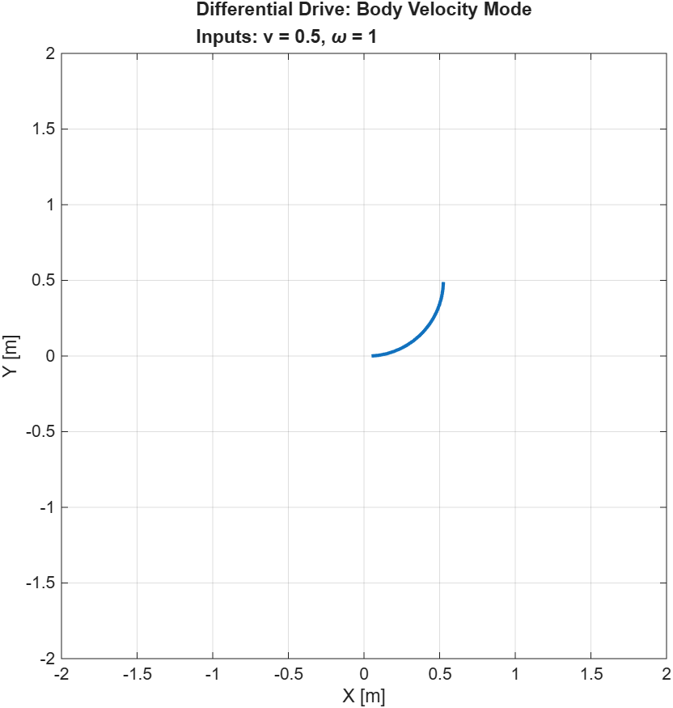
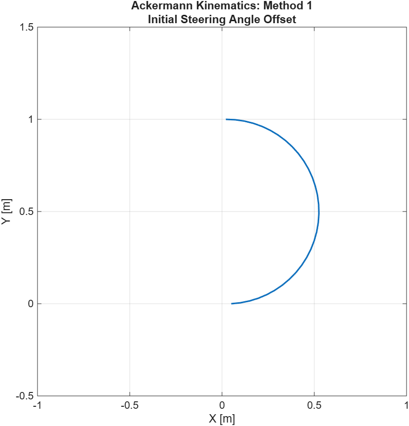

# Mobile Robot Kinematic Simulations

**Date:** May 2026  
**Platform:** MATLAB (Navigation Toolbox)

This repository contains MATLAB Live Scripts demonstrating the kinematic modeling of **Differential Drive** and **Ackermann Steering** vehicles. The project highlights how to bridge the gap between high-level path planning and low-level actuator control.

---

## 🛠 Project Overview

This project explores the MATLAB kinematic classes, focusing on how different input modalities affect robot motion.

### 1. Differential Drive Model
Utilizes the `differentialDriveKinematics` object. It compares:
*   **Body Velocity Mode:** Control via linear velocity ($v$) and angular velocity ($\omega$).
*   **Wheel Speed Mode:** Control via individual left and right wheel speeds ($\omega_L, \omega_R$).

### 2. Ackermann Steering Model
Utilizes the `ackermannKinematics` object to simulate car-like vehicles. It addresses the geometric relationship required for circular motion:
$$\psi = \arctan\left(\frac{L}{R}\right)$$
Where:
*   $L$ is the Wheelbase.
*   $R$ is the turning radius.
*   $\psi$ is the steering angle.

---

## 📊 Visualizations

| Differential Drive Trajectory | Ackermann Steering Trajectory |
| :---: | :---: |
|  |  |

> **Note:** Trajectories are plotted with the X-axis pointing upwards to follow standard robotics "Forward" conventions.

---

## 💻 Implementation Details

### MATLAB Classes Used
The scripts demonstrate the flexibility of MATLAB's robotics classes by toggling the `VehicleInputs` property:
*   `VehicleSpeedHeadingRate`: Uses $[v, \omega]$.
*   `WheelSpeeds`: Uses $[\omega_L, \omega_R]$.
*   `VehicleSpeedSteeringAngle`: Uses $[v, \psi]$.

### Control Logic
For the Ackermann model, a dynamic steering rate controller is implemented to transition from a straight heading to a constant turning radius:
$$\dot{\psi} = \frac{\psi_{desired} - \psi_{current}}{dt}$$

---

## 📂 Repository Structure
*   `DifferentialDriveSim.mlx`: MATLAB Live Script for Diff-Drive simulations.
*   `AckermannSteeringSim.mlx`: MATLAB Live Script for Ackermann simulations.
*   `images/`: Contains exported plots for the README.

## ⚙️ Requirements
*   **MATLAB R2021a** or later.
*   **Navigation Toolbox**.

---
